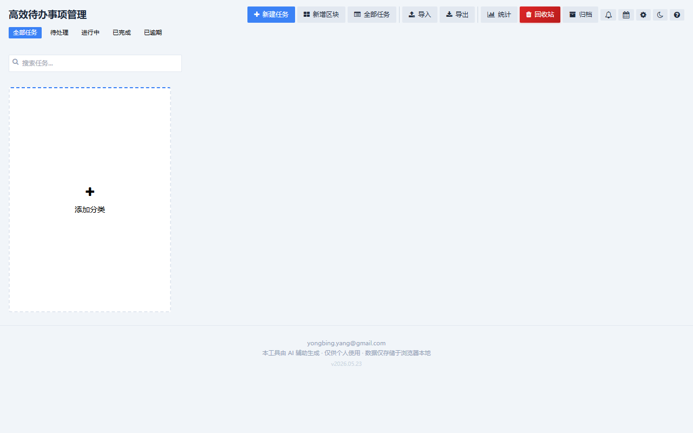
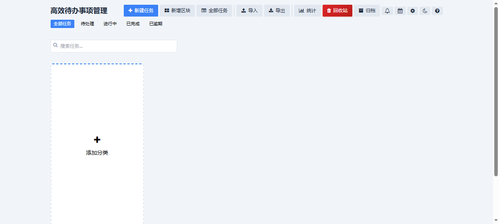
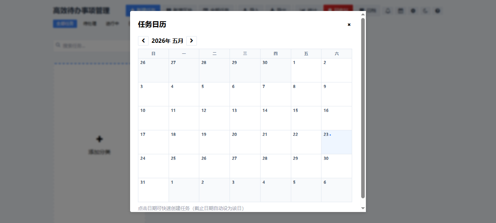
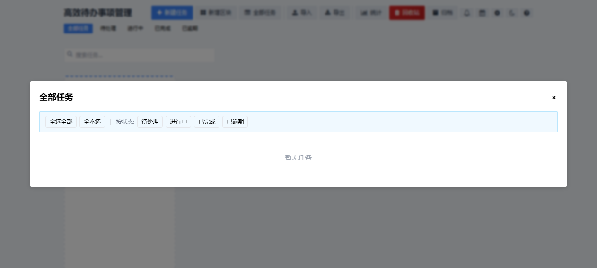
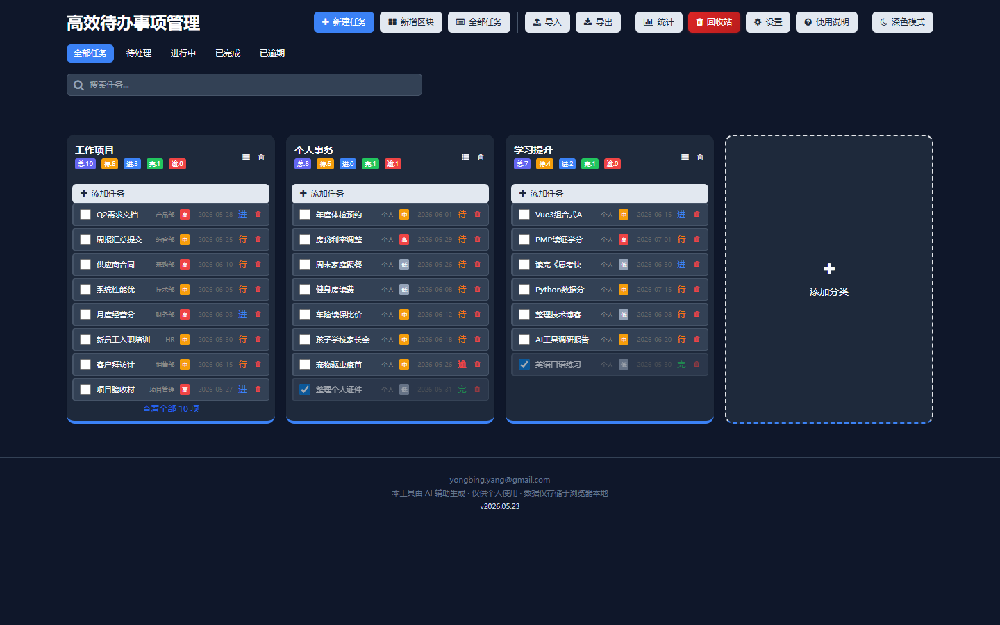
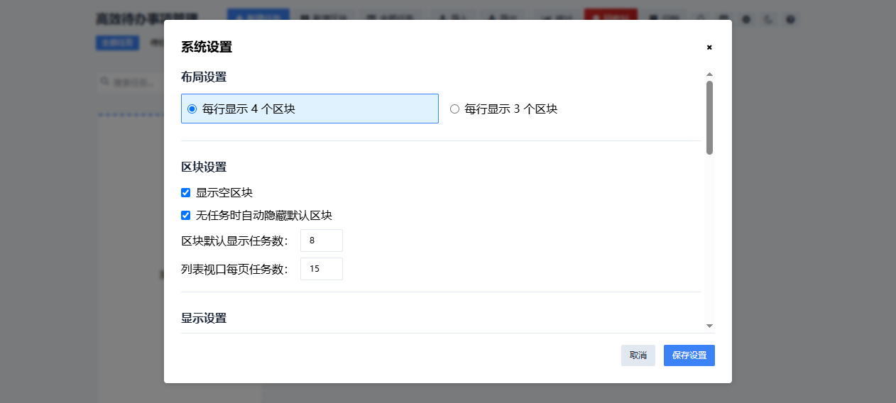

# 高效待办事项管理 (Task Manager)

> 单页任务管理系统 —— 纯前端、零依赖后端、拖拽排序、批量操作、自动备份。
> 示例网页：https://kisson888.github.io/

[](LICENSE)
[](#)

---

## ✨ 功能

| 模块 | 功能 |
|------|------|
| **任务管理** | 新建 / 编辑 / 删除 / 拖拽排序 / 跨区块移动 / 周期性任务(每天/每周/每月/每年) |
| **任务属性** | 标题、部门、优先级(高/中/低)、截止日期、备注、状态、标签、重复周期 |
| **批量操作** | 全选 / 按状态选 / 批量移动 / 改状态 / 改优先级 / 改截止 / 批量删除 |
| **区块(分类)** | 自定义名称、拖拽排序、状态筛选标签、每区块独立排序(标题/日期/重要性/部门)、可隐藏占位卡 |
| **标签系统** | 逗号分隔添加、彩色标签显示、标签筛选栏、设置面板管理标签颜色 |
| **近期到期提醒** | 🔔 图标查看近期到期任务，点击表头排序(任务/区块/截止/时限)，颜色区分紧急度 |
| **任务日历** | 📅 月视图，日期标记任务数，点击日期快速创建任务 |
| **回收站** | 删除任务保留原区块信息，可恢复或彻底清除，粘性表头 |
| **统计面板** | 彩色卡片 + 进度总览条 + 区块统计 + 部门分布，深色适配 |
| **数据导入** | JSON / Excel，导入预览（概况、新建区块、重复数），覆盖/追加模式，可选跳过重复 |
| **数据导出** | JSON / Excel，按区块/状态/重要性多维度筛选后导出 |
| **任务去重** | 自动检测重复任务，可查看详情（含部门/状态/优先级/备注）并手动勾选删除 |
| **自动备份** | 每分钟检测变动，滚动保留 N 份 JSON 备份（份数/频次/存储键可配） |
| **深色模式** | 一键切换，全界面适配 |
| **搜索筛选** | 全局搜索 + 按状态筛选 + 按标签筛选 |
| **布局设置** | 每行 3 / 4 区块可选，区块任务数、分页数可配 |
| **更多** | 悬停全称提示、任务条点击编辑、任务列表序号+分页信息、favicon、页脚版权 |

---

## 📸 应用截图

| 主界面 v2.0 | 近期到期提醒 |
|--------|---------------------|
|  |  |

| 任务日历 | 全部任务 & 批量操作 |
|----------|--------|
|  |  |

| 深色模式 | 设置面板 |
|----------|----------|
|  |  |

> ⚠ 截图可能未及时更新至最新版本，实际界面以浏览器打开为准。

---

## 🚀 快速开始

### 本地使用

1. 下载 `todo.html`
2. 双击用浏览器打开

### 示例数据

导入 `sample-data.json` 可快速体验：25 条任务，3 个区块（工作项目/个人事务/学习提升）。

### 部署到服务器

放到任意静态服务器目录即可，不需要 Node.js / 数据库 / 后端：

```bash
# Nginx 示例
cp todo.html /usr/share/nginx/html/

# 或使用免费托管
# 拖拽上传 todo.html 到 Netlify / Vercel / GitHub Pages
```

---

## 🛠 技术栈

| 用途 | 技术 |
|------|------|
| 页面框架 | 纯 HTML5 + CSS3 |
| UI 样式 | [Tailwind CSS](https://tailwindcss.com/) (CDN) |
| 图标 | [Font Awesome 4.7](https://fontawesome.com/v4/) (CDN) |
| 拖拽排序 | [SortableJS](https://sortablejs.github.io/Sortable/) (CDN) |
| Excel 导入导出 | [SheetJS (xlsx)](https://sheetjs.com/) (CDN) |
| 数据存储 | 浏览器 `localStorage` |

**所有依赖均通过 CDN 加载，无需 `npm install`。**

---

## 📁 文件结构

```
.
├── todo.html            # 完整应用（单文件）
├── index.html           # GitHub Pages 入口（跳转到 todo.html）
├── sample-data.json     # 示例数据（25条任务，3个区块）
├── README.md            # 说明文档
└── LICENSE              # MIT 许可证
```

---

## 🔒 数据隐私

- 所有数据存储在用户浏览器的 `localStorage` 中
- 不会上传到任何服务器
- 导出/导入功能可备份到本地文件
- 无追踪、无广告、无第三方数据收集

---

## 📝 使用说明

### 导航布局
- **第一行**：标题 + 所有操作按钮（新建任务/新增区块/全部任务/导入/导出/统计/回收站/归档）
- **第一行右侧图标**：🔔 近期到期任务 · 📅 任务日历 · ⚙ 设置 · 🌙 深色模式 · ❓ 帮助
- **第二行**：状态筛选（全部/待处理/进行中/已完成/已逾期）
- **第三行**：标签筛选 + 搜索框

### 基本操作
- **新建任务**：点击「新建任务」按钮，或点击区块内的「添加任务」
- **编辑任务**：直接点击任务条
- **删除任务**：点击任务条右侧红色垃圾桶图标（移入回收站）
- **完成任务**：勾选任务左侧复选框
- **添加区块**：点击「新增区块」按钮
- **归档任务**：已完成任务可点击归档图标移入归档区

### 排序与标签
- 每个区块标题栏有 5 个排序按钮：↕ 默认 / 题 标题 / 期 日期 / 要 重要性 / 部 部门
- 点击切换排序方式，再点同按钮切换升/降序
- 任务可添加标签（逗号分隔），设置面板中管理标签颜色

### 近期到期提醒
- 点击顶部 🔔 图标查看未来几天到期任务
- 列表包含序号，点击表头（任务/区块/截止/时限）可排序
- 颜色标识：红 ≤1天 / 橙 ≤3天 / 紫 >3天
- 提前提醒天数可在设置中配置

### 任务日历
- 点击顶部 📅 图标打开月视图日历
- 日期格内显示任务数，点击日期快速创建任务（自动填入截止日期）

### 周期性任务
- 创建/编辑任务时可设置重复周期：每天/每周/每月/每年
- 任务完成后自动创建下一周期

### 批量操作
1. 点击区块的 📋 图标或顶部「全部任务」打开任务列表视口
2. 勾选要操作的任务，或使用「按状态」快捷筛选
3. 工具栏支持：移动 / 改状态 / 改截止 / 改重要性 / 删除

### 数据导入
1. 点击「导入」→ 选择 JSON 或 Excel 文件
2. 预览导入概况（任务数、区块数、新建区块、重复任务数）
3. 选择「覆盖导入」或「追加导入」
4. 追加模式可选「跳过重复任务」

### 数据导出
1. 点击「导出」→ 选择 JSON 或 Excel 格式
2. 按区块 / 状态 / 重要性多维度筛选
3. 实时显示匹配任务数量

### 任务去重
1. 打开「设置」→ 数据去重
2. 点「查看重复详情」浏览所有重复组，可手动勾选删除
3. 或点「一键快速去重」保留每组第一条

### 回收站
- 点击顶部 ♻ 图标打开回收站
- 可逐条恢复/删除，或一键恢复全部/清空

---

## 📋 更新日志

### v2026.05.23

- **UI 大改版**：扁平化界面重设计（边框圆角 2px、无阴影、平板风格）
- **近期到期提醒**：🔔 图标弹窗列表，点击表头排序，红/橙/紫三色标识紧急度
- **任务日历**：📅 月视图，日期标记任务数，点击日期创建任务
- **标签系统**：逗号分隔添加，彩色标签显示与筛选，设置面板管理颜色
- **区块独立排序**：↕ 默认 / 题 标题 / 期 日期 / 要 重要性 / 部 部门
- **周期性任务**：每天/每周/每月/每年，完成自动生成下周期
- **归档机制**：已完成任务可归档，归档区查看和恢复
- **顶部导航优化**：5 个主要操作按钮保留文字，5 个辅助功能（日历/提醒/设置/深色/帮助）图标化
- **任务窗口优化**：底部按钮固定不随滚动，可滚动表单区域
- **使用说明更新**：新增排序/标签/日历/周期性/归档说明

### v2026.05.22 之前的版本

- 初始发布及多项迭代：拖拽排序、批量操作、回收站、导入导出、深色模式、统计面板、自动存档、优先级字段、页脚版权等

---

## 📧 联系方式

yongbing.yang@gmail.com

---

## 📄 许可证

MIT License —— 自由使用、修改、分发。

---

<p align="center">
  <sub>本工具由 AI 辅助生成 · 仅供个人使用</sub>
</p>
